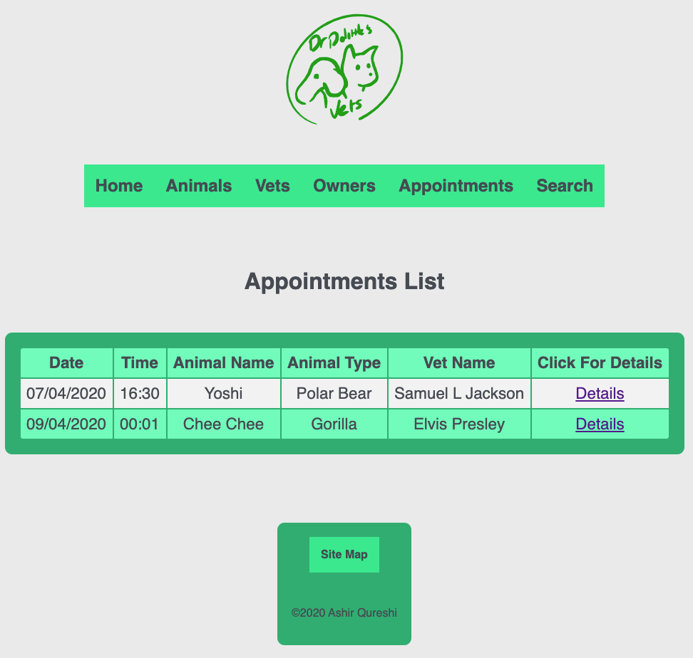

<p align="center">
<image width="300px" height="300px" src="public/images/logo.svg">
  </p>

# Dr Dolittle's Vet Management App

This project is a Vet Management App created by Ashir Qureshi for his CodeClan individual project.


## Getting Started

These instructions will get you a copy of the project up and running on your local machine.


### Prerequisites

What things you need to install the software and how to install them:

1. You will need to install PostGreSQL to carry out database queries:
```
gem install pg
```

2. You will also need Sinatra installed to create a local server for the web interface:
```
gem install sinatra
```

### Installing

A step by step series of examples that tell you how to get a development env running

1. Create a database called 'vetpractice' using psql:
```
createdb vetpractice
```

2. Run the vetpractice SQL file in the newly created database:
```
psql -d vetpractice -f db/vetpractice.sql
```

3. Now seed the database with the included seed file:
```
ruby db/seed.rb
````

## Running the App

To run the app use the followin command:
```
ruby app.rb
```

## Instructions on how to use the app


The website consists of 5 main pages and a search facility accessible by links on the navigation bar.. These are:

### Animals
This will take you to a page listing all animals on the apps records along with options to either register a new animal or see a view of which animals are currently checked into the vets practice. Clicking on any animal listed will give you details about the animal (name, type, DoB, Vet Checked In/Out).


### Vets
This page lists all vets currently listed at the practice. You also get an option to add a new vet to the practice. Clicking on a Vet will give you details about that Vet (name, animals under their care).


### Owners
This page lists all pet owners on the system. Clicking on an owner will take you to details about that owner (Address, Tel No, Registration status, Vets Bill).


### Search
The search page allows you to search the database for the following:
- Animals, searching by name or type.
- Vets, searching by name.
- Owners, searching by name.


### Appointments
The appointments page lists all appointments for vets in the practice.



## Built With

* [Ruby](http://www.ruby-lang.org) - The programming language used for logic/interface
* [PSQL](https://www.postgresql.org/) - Database management
* [Sinatra](https://sinatrarb.com) - To create a local web server

## Authors

* **Ashir Qureshi** - [Ashmanq](https://github.com/Ashmanq)

## Acknowledgments

* The CodeClan team
* My fellow G18 cohort
